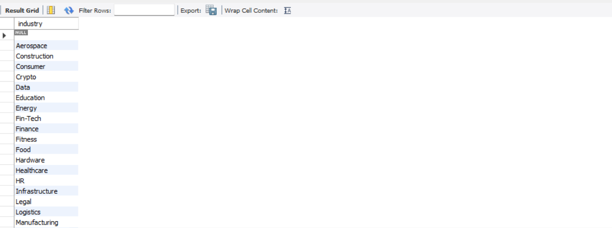

# Data Cleaning Project using MySQL

## Project Overview

This project focuses on cleaning and preparing a raw layoffs dataset using MySQL. 
The goal was to transform unclean data into a structured dataset ready for analysis.

## Tools Used

- MySQL
- SQL

## Dataset Information

Dataset contains company layoffs information including:
- Company
- Location
- Industry
- Total layoffs
- Percentage laid off
- Date
- Stage
- Country
- Funds raised

## Data Cleaning Steps Performed

### 1. Removing Duplicates
- Created a staging table to preserve raw data
- Identified duplicate records using ROW_NUMBER() window function
- Removed duplicate entries

### 2. Data Standardization
- Removed extra spaces using TRIM()
- Standardized inconsistent industry values
- Converted date format into proper DATE format

### 3. Handling Missing Values
- Identified NULL and blank values
- Filled missing industry values using available company records

### 4. Removing Unnecessary Columns
- Removed helper columns after cleaning process

## SQL Concepts Used

- SELECT
- CREATE TABLE
- INSERT
- UPDATE
- DELETE
- JOIN
- CTE
- Window Functions
- ALTER TABLE

## Project Outcome

Successfully cleaned and transformed raw dataset into an analysis-ready format for further reporting and visualization.

## Before Cleaning

Raw dataset contained:
- Duplicate records
- Missing values
- Inconsistent formats

## After Cleaning

Clean dataset achieved:
- Removed duplicate records
- Standardized values
- Fixed date format
- Handled missing data

## Screenshots

### Raw Dataset

### Duplicate Detection

### Data Standardization

### Final Clean Dataset

## Analysis Questions

After cleaning, the dataset can be used to analyze:

- Which companies had highest layoffs?
- Which industries were most affected?
- Which countries had maximum layoffs?
- Layoff trends over time?
