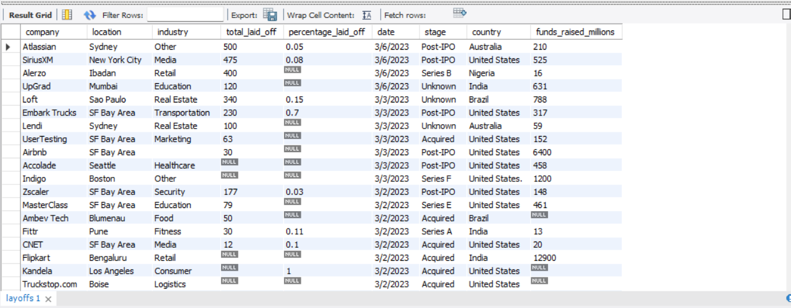
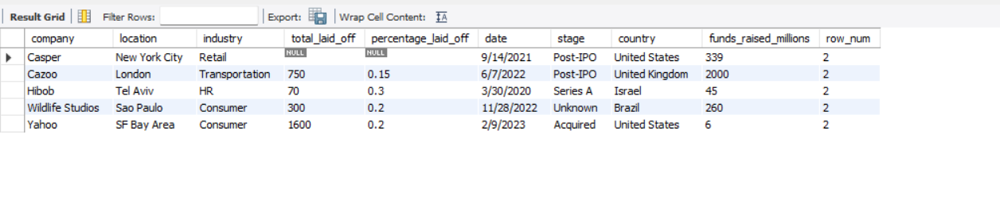
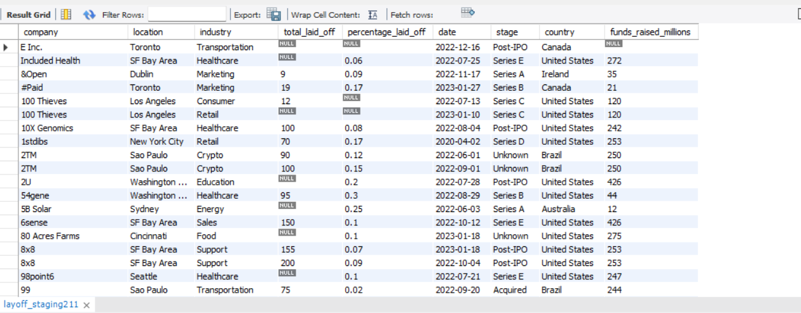

# Data Cleaning Project using MySQL 🧹📊

## Project Overview

This project focuses on cleaning and preparing a real-world layoffs dataset using MySQL.

The main objective was to transform raw and inconsistent data into a clean, structured, and analysis-ready dataset by removing errors, handling missing values, and standardizing data formats.

This cleaned dataset was then prepared for further analysis and visualization.

---

## Tools & Technologies

- MySQL
- SQL

---

## Dataset Description

The dataset contains company layoffs information including:

- Company
- Location
- Industry
- Total layoffs
- Percentage laid off
- Date
- stage
- Country
- Funds raised

---

## Data Cleaning Process

### 1. Removing Duplicate Records

- Identified duplicate entries using Window Functions
- Used ROW_NUMBER() to detect repeated records
- Removed unnecessary duplicate data

---

### 2. Data Standardization

Performed data formatting and consistency improvements:

- Removed extra spaces using TRIM()
- Standardized industry values
- Converted date formats into proper DATE format

---

### 3. Handling Missing Values

- Identified NULL and blank values
- Updated missing industry information where possible
- Improved data completeness

---

### 4. Removing Unnecessary Columns

- Removed helper columns after cleaning
- Created a final clean dataset ready for analysis

---

## SQL Concepts Used

- CREATE TABLE
- INSERT INTO
- UPDATE
- DELETE
- ALTER TABLE
- CTE (Common Table Expressions)
- ROW_NUMBER()
- Window Functions
- Date Conversion Functions
- Data Transformation

---

## Project Workflow

Raw Dataset  
⬇️  
Data Cleaning using SQL  
⬇️  
Standardized Dataset  
⬇️  
Analysis Ready Data

---

## Key Improvements Made

✔ Removed duplicate records  
✔ Standardized inconsistent values  
✔ Fixed date formatting issues  
✔ Handled missing data  
✔ Created clean structured dataset  

---

## Project Screenshots

### Raw Dataset

### Duplicate Detection

### Data Standardization

### Final Clean Dataset

---

## Conclusion

This project demonstrates the importance of data cleaning in analytics workflows.

By applying SQL-based cleaning techniques, raw data was converted into a reliable dataset suitable for analysis and reporting.
